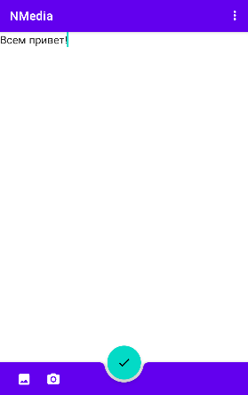
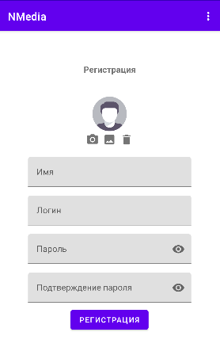

# О приложении

Приложение "Чат" разработано в ходе изучения Android-разработки в университете интернет-профессий "Нетология".
Backend выдан как исходные данные к разработке и запускается локально.
---

# Возможности приложения
### 1. Лента постов
- Новые посты подгружаются с сервера с пагинацией
- Пользователю доступо создание собственных постов после прохождения авторизации
- Автоматическая подгрузка новых постов отключена, PREPEND выпляется через SwipeOnRefresh
- Посты разделяются сепараторами по времени создания
- Посты сохраняются в локальную базу
- Приожение отслеживает количество новых постов на сервере и отображает кнопку загрузки
- Поддержка прикрепление картинки к посту

### 2. Авторизация и регистрация
- Для перехода к регистрации и авторизации используется меню в заголовке
- Поддержка прикрепления аватарки к аккаунту
- Данные авторизации сохраняются в SharedPreference

---
# Используемые технологии
- Kotlin + Coroutines
- MVVM + Single Activity
- Room
- OkHttp/Retrofit
- LiveData/Flow
- Paging
- Hilt
- Glide
- Image Picker
- Navigation Components
- Intents
- Pushes (FCM)
- Material IO
